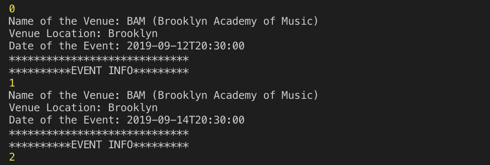
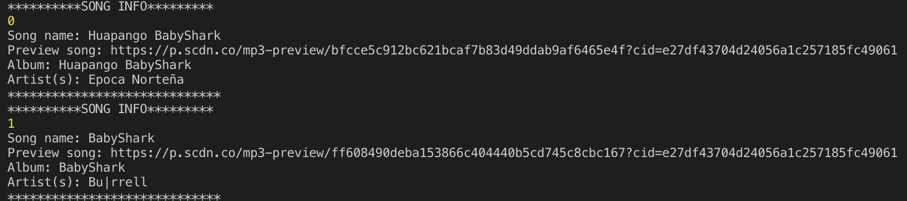
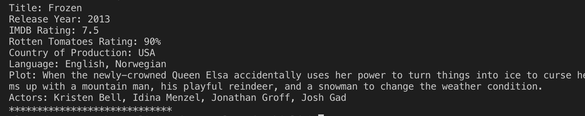

# liri-node-app

liri-node-app is a command line app that takes in parameters and returns data. Users have the option of using four commands:

concert-this

spotify-this-song

movie-this

do-what-it-says

Step by Step instructions
Open your terminal.

Navigate to the liri-node-app folder

Command 1: Run the concert-this command
node liri.js concert-this <name of artist or band goes here>
Output: The system will display a list of all events where the band is going to perform. It can result in multiple outputs. See screen-shot

Command 2: Run the spotify-this-song command
node liri.js spotify-this-song <name of song goes here>
Output: The system will display a list of this song. It can result in multiple outputs. See screen-shot

Command 3: Run the movie-this command
node liri.js movie-this <name of movie goes here>
Output: The system will display information associated with this movie. See screen-shot 

These commands also append the data returned to a log.txt file 

TECHNOLOGIES USED
Git
GitHub
Javascript
Nodejs
APIs used:
Bands in Town
OMDB
Node packages:
AXIOS
Node-Spotify-API
Request
Moment
DotEnv

